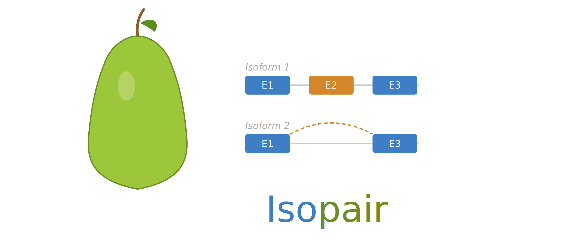

<p align="center">
  
</p>

# Isopair

**Isoform Pair Structural Analysis**

Isopair detects, characterizes, and compares structural differences between
isoform pairs. Given a GTF annotation and expression data, it identifies 12
types of splicing events, builds splicing choice profiles, and provides
statistical tools for single-set characterization and cross-set comparison.

## Installation

Isopair requires R >= 4.1.0 and Bioconductor dependencies.

```r
# Install Bioconductor dependencies
if (!requireNamespace("BiocManager", quietly = TRUE))
    install.packages("BiocManager")
BiocManager::install("rtracklayer")

# Install Isopair from source
# Option 1: From a local clone
install.packages("/path/to/Isopair", repos = NULL, type = "source")

# Option 2: Using remotes (when hosted on GitHub)
# remotes::install_github("username/Isopair")
```

**Optional packages** for full functionality:

```r
# Visualization
install.packages("ggplot2")

# Meta-analysis
install.packages("metafor")
```

## Quick Start

```r
library(Isopair)

# 1. Parse isoform structures from a GTF
gtf_path <- system.file("extdata", "example_small.gtf", package = "Isopair")
structures <- parseIsoformStructures(gtf_path)

# 2. Build union exons (common coordinate system)
ue <- buildUnionExons(structures)

# 3. Load expression data and generate pairs
expr_df <- read.csv(
  system.file("extdata", "example_expression.csv", package = "Isopair"))
expr_mat <- as.matrix(expr_df[, -1])
rownames(expr_mat) <- expr_df$isoform_id

gene_map <- unique(as.data.frame(structures[, c("isoform_id", "gene_id")]))
pairs <- generatePairsExpression(expr_mat, gene_map,
  colnames(expr_mat), method = "top_two")

# 4. Build profiles (detect events + verify reconstruction)
profiles <- buildProfiles(pairs, structures,
  ue$union_exons, ue$isoform_union_mapping)

# 5. Summarize
summarizeProfiles(profiles)
```

## What It Detects

Isopair identifies 12 event types organized in 4 categories:

| Category | Event Types |
|---|---|
| **Terminal** | Alt_TSS, Alt_TES |
| **Boundary** | A5SS, A3SS, Partial_IR_5, Partial_IR_3 |
| **Exon-level** | SE (Skipped Exon), Missing_Internal |
| **Intron retention** | IR, IR_diff_5, IR_diff_3, IR_diff_5_3 |

Events are described from the **comparator's perspective**:
- **LOSS**: the comparator lost sequence relative to the reference
- **GAIN**: the comparator gained sequence relative to the reference

Every detected event set is verified by reconstructing the reference isoform
from the comparator plus the events — ensuring the event catalog fully explains
the structural differences.

## Workflow Overview

### Core Pipeline

| Step | Function | Description |
|---|---|---|
| 1 | `parseIsoformStructures()` | Parse GTF into nested exon structures |
| 2 | `buildUnionExons()` | Create atomic union exon coordinate system |
| 3 | `generatePairsExpression()` | Generate isoform pairs from expression data |
|   | `generatePairsDE()` | ...or from differential expression results |
|   | `generatePairsDU()` | ...or from differential usage results |
| 4 | `buildProfiles()` | Detect events, build splicing choice profiles |

### Single-Set Characterization

| Function | Analysis |
|---|---|
| `summarizeProfiles()` | Event frequency summary statistics |
| `testCooccurrence()` | Event type co-occurrence (Fisher's exact tests) |
| `testPositionalBias()` | Positional bias along gene body |
| `classifyTopology()` | A5SS/A3SS pair topology (F2F, B2B, Distal) |
| `testProximity()` | Event clustering via permutation test |
| `extractCdsAnnotations()` | Extract CDS boundaries from GTF |
| `annotateRegionTypes()` | Label exons as 5'UTR, CDS, 3'UTR, etc. |
| `mapEventsToRegions()` | Map events to genomic regions |
| `testRegionalEnrichment()` | Regional enrichment (binomial tests) |
| `testOrfBoundarySusceptibility()` | ORF boundary event enrichment |
| `summarizeOrfImpact()` | Terminal event impact on ORF |
| `computePtcStatus()` | Premature termination codon detection |
| `testPtcAssociation()` | PTC association between pair members |
| `analyzeFrameDisruption()` | Reading frame disruption analysis |

### Cross-Set Comparison

| Function | Description |
|---|---|
| `comparePairSets()` | 10 statistical tests comparing two profile sets |
| `metaAnalyzePairSets()` | Random-effects meta-analysis across comparisons |

Results from `comparePairSets()` are **self-documenting**: each test section
includes the description, method, p-value, effect size, and the exact data
that entered the test.

## Pair Generation Methods

Isopair supports three strategies for creating isoform pairs:

1. **Expression baseline** (`generatePairsExpression`): Pair the two most
   highly expressed isoforms per gene. Useful for characterizing the dominant
   splicing landscape.

2. **Differential expression** (`generatePairsDE`): Pair each significantly
   DE isoform against its gene's dominant isoform. Requires
   `identifyDominantIsoforms()` to first determine dominants.

3. **Differential usage** (`generatePairsDU`): Pair isoforms with the largest
   opposite usage changes within each gene. Captures condition-driven
   isoform switching.

## Example Data

Isopair ships with data from 5 genes (SRSF3, SRSF1, BCL2L1, TP63, FAM13A)
extracted from GENCODE v49:

```r
data(example_structures)  # 25 isoforms, parsed exon structures
data(example_pairs)       # 5 expression-derived pairs
data(example_profiles)    # 5 profiles with 22 total events
```

Additional files in `inst/extdata/`:
- `example_small.gtf` — GTF for the 5 example genes
- `example_expression.csv` — mock expression matrix
- `example_de.csv` — mock differential expression results
- `example_du.csv` — mock differential usage results

## Vignette

A detailed walkthrough of the full pipeline is available in the package
vignette. After installation:

```r
vignette("Isopair")
```

A pre-built HTML version is available at
[`vignettes/Isopair.html`](vignettes/Isopair.html).

## Testing

Isopair includes a comprehensive test suite with 8266 expectations:

```r
devtools::test()
```

## Citation

If you use Isopair in your research, please cite:

> Castaldi PJ. Isopair: Isoform Pair Structural Analysis. R package version
> 0.99.0.
